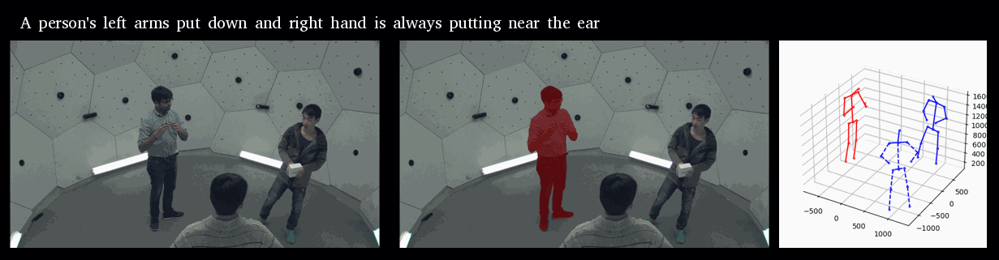
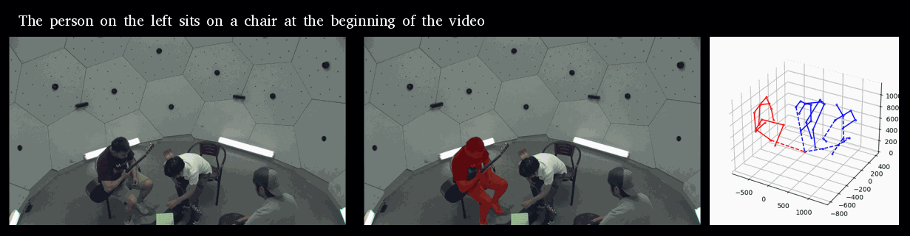
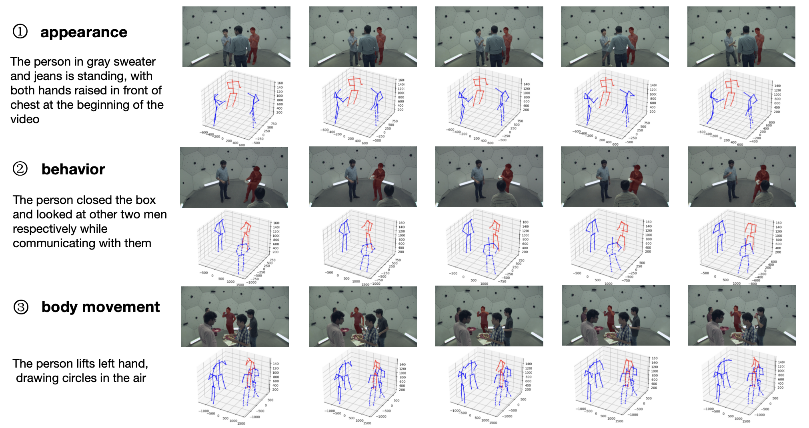
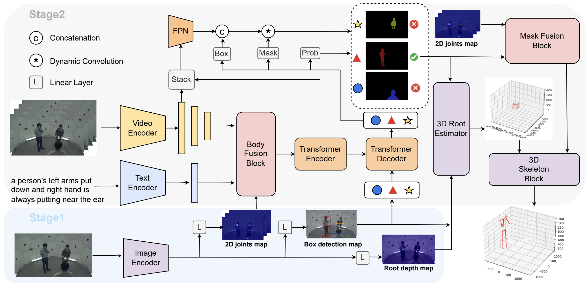

# Language-driven 3D Human Pose Estimation: Grounding Motion from Text Descriptions




## 📢 Updates
- **Aug. 14, 2024**: We release our data loading and processing document

## 📑 Panoptic-L3D Dataset


## 📖 Abstract
In an NBA game scenario, consider the challenge of locating and analyzing the 3D poses of players performing a user-specified action, such as attempting a shot. Traditional 3D human pose estimation (3DHPE) methods often fall short in such complex, multi-person scenes due to their lack of semantic integration and reliance on isolated pose data. To address these limitations, we introduce Language-Driven 3D Human Pose Estimation (L3DHPE), a novel approach that extends 3DHPE to general multi-person contexts by incorporating detailed language descriptions. We present Panoptic-L3D, the first dataset designed for L3DHPE, featuring over 3,800 linguistic annotations for more than 1,400 individuals across over 500 videos, with frame-level 3D skeleton annotations. Additionally, we propose Cascaded Pose Perception (CPP), a benchmarking method that simultaneously performs language-driven mask segmentation and 3D pose estimation within a unified model. CPP first learns 2D pose information, utilizes a body fusion module to aid in mask segmentation, and employs a mask fusion module to mitigate mask noise before outputting 3D poses. Our extensive evaluation of CPP and existing benchmarks on the Panoptic-L3D dataset demonstrates the necessity of this novel task and dataset for advancing 3DHPE.

## 📗 CPP FrameWork


## Data Preparation

### First, download videos and skeletons at <a href="https://github.com/CMU-Perceptual-Computing-Lab/panoptic-toolbox">here</a>

Here is an example process:

```
git clone https://github.com/CMU-Perceptual-Computing-Lab/panoptic-toolbox
cd panoptic-toolbox
```
Then, open the file of "./scripts/getData.sh" and change some code:
```
# First, change line 74
# from
nodes=(0 1 2 3 4 5 6 7 8 9 10 11 12 13 14 15 16 17 18 19 20 21 22 23 24 25 26 27 28 29 30)
# to
nodes=(16 30) # we only need 16 and 30 cameras
# Second, delete line 100-114.
```
Next, run the following code to get data:
```
./scripts/getData.sh 160224_haggling1 0 2
```
Finally, run the following code to extract data (you need install ffmpeg at first):
```
./scripts/extractAll.sh 160224_haggling1
```
Change "160224_haggling1" to the name in the video list and run the above code again.

Video list are the following:
160422_haggling1, 160226_haggling1, 160224_haggling1, 170404_haggling_a2, 170407_haggling_b2, 170221_haggling_b2, 160422_ultimatum1, 160906_band1, 160906_band2, 160906_band3, 160906_pizza1, 160906_ian1, 160906_ian2, and 160906_ian3.

Camera list are the following:
HD16 and HD30


### Second, download descriptions and masks of Panoptic-L3D dataset at  <a href="https://languagedriven3dposeestimation.github.io/">here</a>

### Third, store datas as the following structure:

```text
data_root
└── Panoptic-L3D/ 
    ├── sentences_test.json
    ├── sentences_train.json
    ├── sentences_val.json
    ├── storage_mask/
    │   └── */ (video_id folders)
    │       └── */ (camera_id folders)
    |           └── *.png (masks)
    └── panoptic/
        ├── 160224_haggling1/
        │   ├── hdImgs/
        │   │   ├── 00_16/
        │   │   │   ├── 00_16_00000784.jpg
        │   │   │   └── *.jpg (images)
        │   │   └── 00_30/
        │   │       └── *.jpg (images)
        │   ├── hdPose3d_stage1_coco19/
        │   │    └── *.json (json files)   
        │   └── calibration_160224_haggling1.json
        └── */ (other video_id folders)
```

### Fourth, change the root_path and output_path to your own path
change the config in "./configs/defaults.yaml":
```
# line 5
OUTPUT_PATH: './output'
# change "./output" to your output folder.
# line 78
ROOT: './data'
# change './data' to your data_root folder.
```
